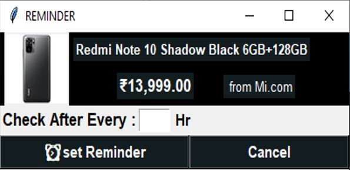

# online-price-comparision-application 

## project overview:

our application scrap the data from different website like amazon flipkart amazon other website 
and compare the price of product and show the product to user 
user can also set remainder on product whenever the product price comes down user can user will 
get and email that product price comes down you can buy this product 

## login page 

## sign up page 

## update login page

## search page

## search Result page

## review page

## wishlist page 

## remainder page 

